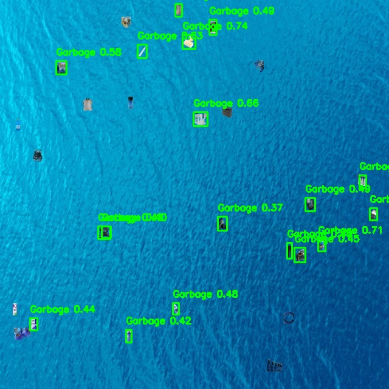
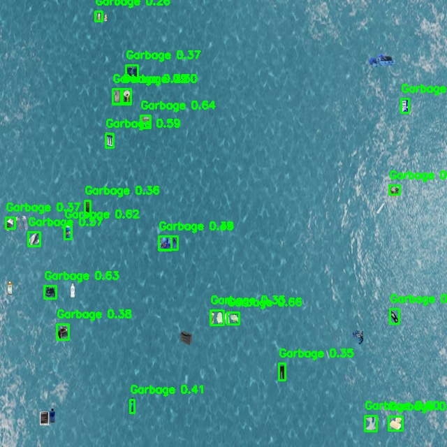
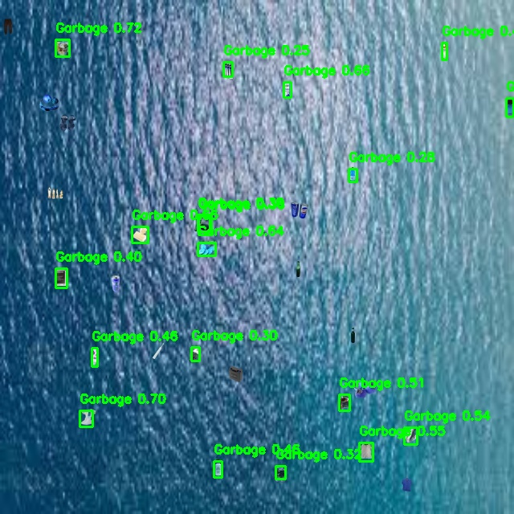
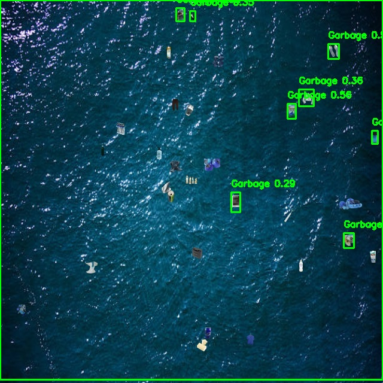
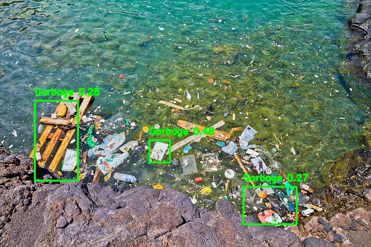
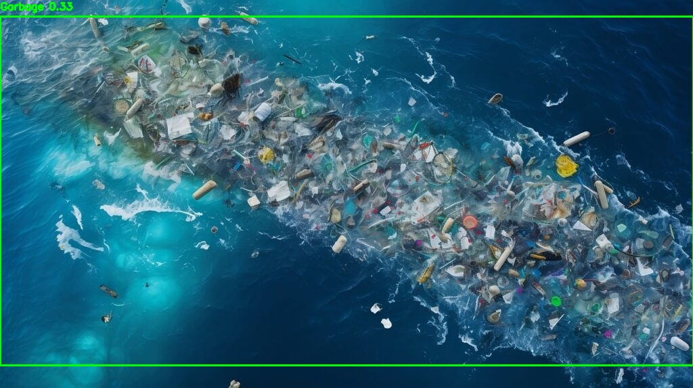

# **Sall-e – Autonomous Robot for Oceanic Garbage Collection**


## **Background and Mission** 🤖♻️

The world's oceans are facing a critical threat from plastic pollution, with an estimated **[150 million tonnes of plastic waste present as of 2016](https://en.wikipedia.org/wiki/Great_Pacific_Garbage_Patch)**, projected to increase to **[ 250 million tonnes by 2025](https://en.wikipedia.org/wiki/Marine_plastic_pollution)**. This pollution poses severe risks to marine life, ecosystems, and human health.

  

The "Sall-e" project aims to address this issue by developing an integrated system that utilizes computer vision AI to detect marine debris and deploys robotic solutions for its collection. By leveraging drone imagery and advanced object detection models, Sall-e seeks to identify and localize garbage in ocean environments, facilitating efficient cleanup operations.

  

---

## **Synthetic Testing Image Generation** 📸

To evaluate the model's performance in realistic scenarios, we developed a Python script `synthetic.py` to create synthetic testing images. The script performs the following tasks:

1. **Image Preparation**: Numerous ocean background image (`ocean 1-4 images`) of different sizing is resized to 640×640 pixels to match the model's input requirements.

2. **Object Extraction**: Randomly selects 10 images from the `dataset/test/images` directory and uses their corresponding YOLO-format annotation files from `dataset/test/labels` to extract labeled garbage objects.

3. **Synthetic Image Creation**: Pastes the extracted objects onto the resized ocean background at random locations, generating three synthetic testing images. These images are saved in the `testing` directory for subsequent evaluation.

---

## **Simulation Images Testing Environment** 🧪
<details>
  <summary><strong>List Testing Images</strong></summary>

  <details>
    <summary><strong>Testing Synthetic Environment 1</strong></summary>
    
  </details>
  <details>
    <summary><strong>Testing Synthetic Environment 2</strong></summary>
    
  </details>
  <details>
    <summary><strong>Testing Synthetic Environment 3</strong></summary>
    
  </details>
  <details>
    <summary><strong>Testing Synthetic Environment 4</strong></summary>
    
  </details>
  <details>
    <summary><strong>Testing Real Environment 1</strong></summary>
    
  </details>
  <details>
    <summary><strong>Testing Real Environment 2</strong></summary>
    
  </details>

</details>

---

## **Approach to Model Self-Training** ⚡

To equip Sall-e with the capability to detect marine debris, we employed the YOLOv11m object detection model, leveraging the Ultralytics Hub for training and deployment. The training process involved the following steps:

1. **Dataset Selection**: We utilized the "Garbage Detection UAV" dataset from Roboflow Universe, which comprises 4,486 images annotated for various types of garbage. The dataset is partitioned into 70% training, 20% validation, and 10% testing subsets.

2. **Data Preparation**: The dataset was uploaded to the Ultralytics Hub, ensuring compatibility with the YOLOv11m model requirements.

3. **Model Configuration**:
<details>
  <summary><strong>Configuration</strong></summary>
    The <strong>YOLOv11m</strong> model was configured with the following parameters:
    <li><strong>Epochs</strong>: 200</li>
    <li><strong>Image Size</strong>: 640×640 pixels</li>
    <li><strong>Patience</strong>: 100</li>
    <li><strong>Cache Strategy</strong>: RAM</li>
    <li><strong>Device</strong>: GPU</li>
    <li><strong>Batch Size</strong>: 32</li>
</details>

4. **Training**: The model was trained using the Ultralytics Hub's infrastructure, optimizing for accuracy in detecting and localizing garbage objects in aerial imagery.

5. **Model Metrics** :
  

<details>
  <summary><strong>Model Loss Metrics</strong></summary>
      
</details>

<details>
  <summary><strong>Model Result Evaluations</strong></summary>
    
</details>

---

## **Simulation Images Garbage Self-trained Model Detection** 🔍
<details>
  <summary><strong>List Self-trained Detection Images</strong></summary>

  <details>
    <summary><strong>Detection Synthetic Environment 1</strong></summary>
    
  </details>
  <details>
    <summary><strong>Detection Synthetic Environment 2</strong></summary>
    
  </details>
  <details>
    <summary><strong>Detection Synthetic Environment 3</strong></summary>
    
  </details>
  <details>
    <summary><strong>Detection Synthetic Environment 4</strong></summary>
    
  </details>
  <details>
    <summary><strong>Detection Real Environment 1</strong></summary>
    
  </details>
  <details>
    <summary><strong>Detection Real Environment 2</strong></summary>
    
  </details>

</details>

---

## **Multi-Model Garbage Detection** 🔄
The **Sall-e** project integrates multiple models to enhance garbage detection using computer vision. The implementation leverages three different object detection models:

<details>
  <summary><strong>External Model 1: YOLOv5-Based Waste Detection</strong></summary>
  <li>This model is sourced from <strong>Hugging Face</strong> and fine-tuned for waste classification.</li>
  <li>Repository: <a href="https://huggingface.co/turhancan97/yolov5-detect-trash-classification">YOLOv5 Waste Detection Model</a></li>
</details>

<details>
  <summary><strong>External Model 2: DETR-Based Waste Detection</strong></summary>
  <li>This model is built on <strong>DEtection TRansformer (DETR)</strong> architecture and fine-tuned on waste detection.</li>
  <li>Repository: <a href="https://huggingface.co/Yorai/detr-resnet-50_finetuned_detect-waste">DETR Waste Detection Model</a></li>
  <li>The model utilizes a <strong>ResNet-50</strong> backbone and processes images using PyTorch and the <italic>transformers</italic> library.</li>
</details>

---

## **Simulation Garbage Multi-modal Detection** 🤝
<details>
  <summary><strong>List Multi-modal Detection with Annotation</strong></summary>

  <details>
    <summary><strong>Detection Synthetic Environment 1</strong></summary>
    
  </details>
  <details>
    <summary><strong>Detection Synthetic Environment 2</strong></summary>
    
  </details>
  <details>
    <summary><strong>Detection Synthetic Environment 3</strong></summary>
    
  </details>
  <details>
    <summary><strong>Detection Synthetic Environment 4</strong></summary>
    
  </details>
  <details>
    <summary><strong>Detection Real Environment 1</strong></summary>
    
  </details>
  <details>
    <summary><strong>Detection Real Environment 2</strong></summary>
    
  </details>

This multi-model approach provides better benchmarking and performance analysis for garbage detection in oceanic environments, improving robustness across different detection architectures. 
</details>

---

## **Garbage Collection Simulation Video** 🎥
The **Garbage Collection Simulation** visualizes how an autonomous floating robot, **Sall-e**, navigates an ocean environment to collect garbage using AI-based object detection.

### **Simulation Features**:
- The robot starts at the **top-left corner** of the environment.
- It detects **the nearest garbage object** and moves towards it.
- The robot can **move diagonally** and **rotates accordingly** based on its movement direction.
- The robot moves at **40 pixels per second**.
- Once the robot reaches a garbage object, the object is **flagged as collected** and removed from the scene.
- The simulation continues until all objects are collected or the user stops the program.
## Multi-Model Garbage Detection

The **Sall-e** project integrates multiple models to enhance garbage detection using computer vision. The implementation leverages three different object detection models:

### 1. Self-Trained Model
- This model was trained using **Ultralytics YOLOv11m** with a dataset of oceanic garbage images.
- The dataset was sourced from **Roboflow** and fine-tuned on labeled drone-captured images.
- The trained model is stored in `garbage_detector.pt` and performs inference on the test images, saving results in the `detect1` folder.

### 2. External Model 1: YOLOv5-Based Waste Detection
- This model is sourced from **Hugging Face** and fine-tuned for waste classification.
- Repository: [YOLOv5 Waste Detection Model](https://huggingface.co/turhancan97/yolov5-detect-trash-classification)
- This model runs on YOLOv5 and processes test images, saving results in the `detect2` folder.

### 3. External Model 2: DETR-Based Waste Detection
- This model is built on **DEtection TRansformer (DETR)** architecture and fine-tuned on waste detection.
- Repository: [DETR Waste Detection Model](https://huggingface.co/Yorai/detr-resnet-50_finetuned_detect-waste)
- The model utilizes a **ResNet-50** backbone and processes images using PyTorch and the `transformers` library.
- Detection results are saved in the `detect3` folder.

### Running Multi-Model Inference
- The script runs all three models sequentially on test images stored in `/testing`.
- The results from each model are combined and visualized, with bounding boxes and confidence scores labeled.
- Final detection outputs from all three models are stored in the `detect` folder for comparison and evaluation.

This multi-model approach provides better benchmarking and performance analysis for garbage detection in oceanic environments, improving robustness across different detection architectures.

## Garbage Collection Simulation
The **Garbage Collection Simulation** visualizes how an autonomous floating robot, **Sall-e**, navigates an ocean environment to collect garbage using AI-based object detection.

### **Simulation Features**:
- The robot starts at the **top-left corner** of the environment.
- It detects **the nearest garbage object** and moves towards it.
- The robot can **move diagonally** and **rotates accordingly** based on its movement direction.
- The robot moves at **40 pixels per second**.
- Once the robot reaches a garbage object, the object is **flagged as collected** and removed from the scene.
- The simulation continues until all objects are collected or the user stops the program.
- The simulation is recorded as a **video file**:
  
  <video width="640" height="640" controls>
    <source src="simulation/simulation.mp4" type="video/mp4">
    Your browser does not support the video tag.
  </video>

This simulation helps visualize the efficiency of the garbage collection system and showcases the AI-driven movement strategy of the Sall-e robot.

---

## **Project Setup** 🛠️

Clone this project:
```bash
  git clone https://github.com/Lelekhoa1812/Sall-e.git
```

Dependencies Installation:  
```bash
  pip install -r requirements.txt
```

Run self-trained detection:  
```bash
  python3 detect.py
```

Run multi-modal detection:  
```bash
  python3 multimodal.py
```

---

## **Project Structure** 📁
```plaintext
/dataset/
  ├── test/
  ├── train/
  ├── valid/
  ├── data.yaml
  ├── README
/split.py              # custom splitting the dataset
/crop.py               # crop object from data sample
/synthetic.py          # generate synthetic testing img simulating ocean top-view
/detect.py             # generate img simulating garbage detection on ocean
/Inference.ipynb       # example usages of 3 external models (from HF) for backup
/crop/                 # cropped .png images sample from various garbage classes
  ├── plastic/
  ├── metal/
  ├── clothes/
  ├── carton/
  ├── ...
/testing/
/detect/
/detect1/
/model/
  ├── garbage_detector.pt
/sample/
/src/
  ├── ocean1.jpg
  ├── ocean2.avif
  ├── ocean3.jpeg
  ├── ocean4.jpg
  ├── results.png
  ├── eval.png
  ├── loss.png 
/README
```

---

## **Dataset Acknowledgment and Statistics** 📊

We acknowledge the use of the **[Garbage Detection UAV](https://en.wikipedia.org/wiki/Great_Pacific_Garbage_Patch)** dataset from Roboflow Universe in our project. The dataset's key statistics are as follows:

- **Total Images**: 4,486
- **Training Set**: 70% (3,140 images)
- **Validation Set**: 20% (897 images)
- **Test Set**: 10% (449 images)

The dataset encompasses a diverse range of garbage types, providing a robust foundation for training the object detection model.

---

## **Conclusion** 🏁🚀

The Sall-e project represents a concerted effort to harness advanced technologies in addressing the pressing issue of oceanic plastic pollution. By integrating computer vision and robotics, we aim to enhance the efficiency and effectiveness of marine debris detection and collection, contributing to the preservation of ocean health and biodiversity.

---

## **Acknowledgement of Resources** ✍️
This project is a product from unit ENG30002 - Engineering Technology Sustainability Project, Swinburne University of Technology.  
