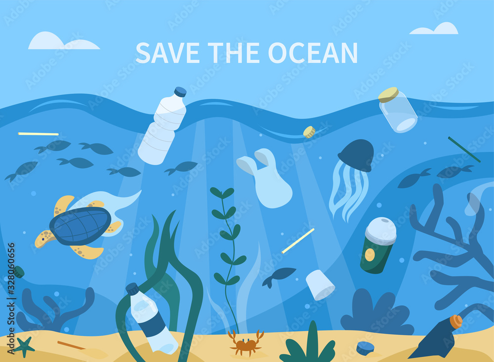
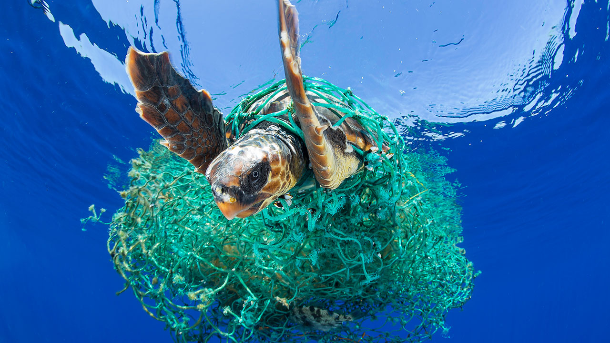
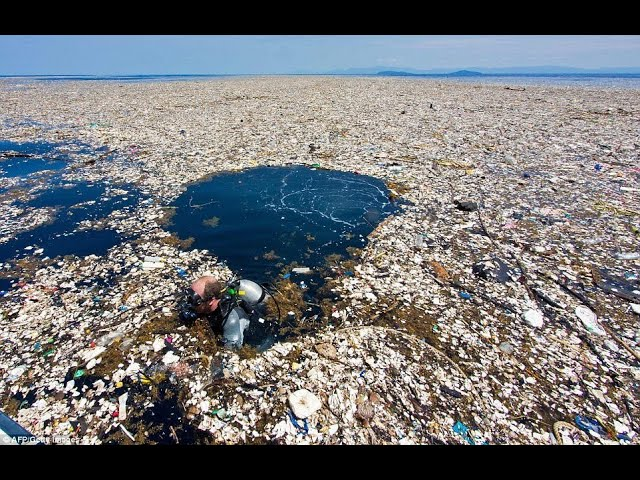
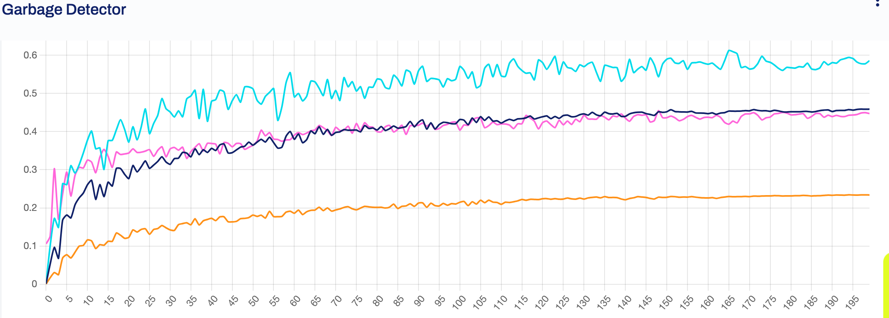
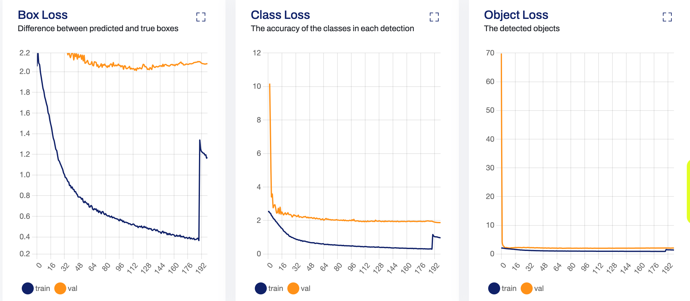
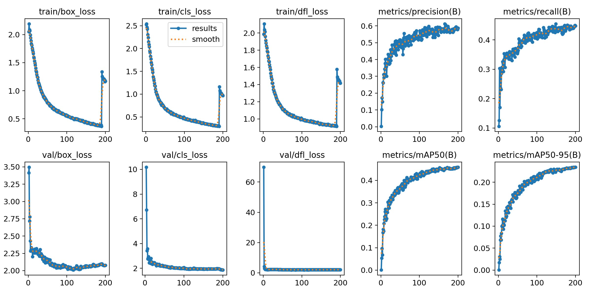
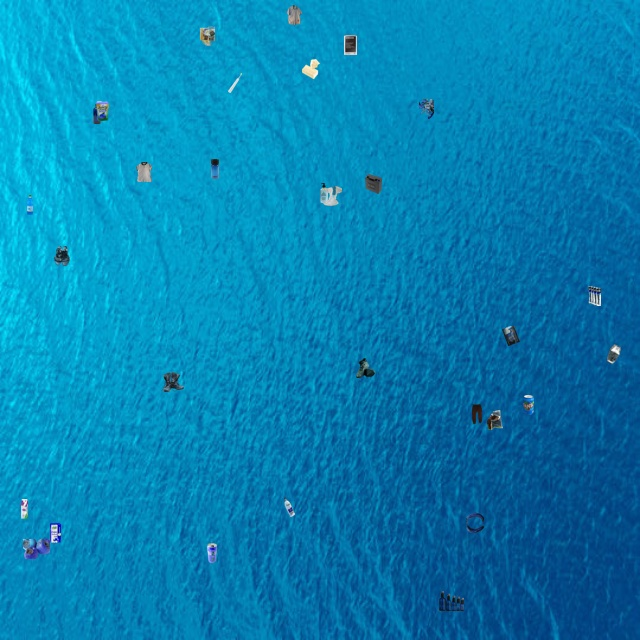
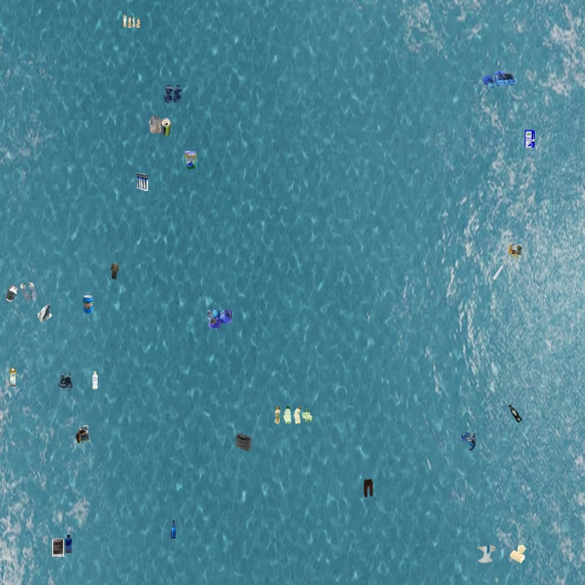
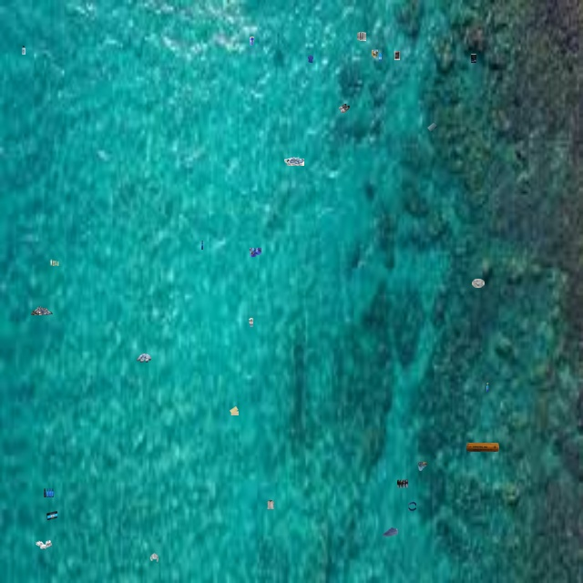
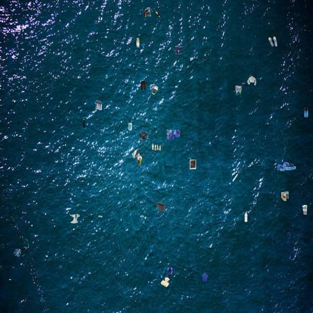

# **Sall-e – Autonomous Robot for Oceanic Garbage Collection**



## **Background and Mission** 🤖♻️

The world's oceans are facing a critical threat from plastic pollution, with an estimated **[150 million tonnes of plastic waste present as of 2016](https://en.wikipedia.org/wiki/Great_Pacific_Garbage_Patch)**, projected to increase to **[ 250 million tonnes by 2025](https://en.wikipedia.org/wiki/Marine_plastic_pollution)**. This pollution poses severe risks to marine life, ecosystems, and human health.

  

The "Sall-e" project aims to address this issue by developing an integrated system that utilizes computer vision AI to detect marine debris and deploys robotic solutions for its collection. By leveraging drone imagery and advanced object detection models, Sall-e seeks to identify and localize garbage in ocean environments, facilitating efficient cleanup operations.

  

---

## **Approach to Model Training** ⚡

To equip Sall-e with the capability to detect marine debris, we employed the YOLOv11m object detection model, leveraging the Ultralytics Hub for training and deployment. The training process involved the following steps:

1. **Dataset Selection**: We utilized the "Garbage Detection UAV" dataset from Roboflow Universe, which comprises 4,486 images annotated for various types of garbage. The dataset is partitioned into 70% training, 20% validation, and 10% testing subsets.

2. **Data Preparation**: The dataset was uploaded to the Ultralytics Hub, ensuring compatibility with the YOLOv11m model requirements.

3. <details>
  <summary><strong>Model Configuration</strong></summary>
    The <strong>YOLOv11m</strong> model was configured with the following parameters:
    <li><strong>Epochs</strong>: 200</li>
    <li><strong>Image Size</strong>: 640×640 pixels</li>
    <li><strong>Patience</strong>: 100</li>
    <li><strong>Cache Strategy</strong>: RAM</li>
    <li><strong>Device</strong>: GPU</li>
    <li><strong>Batch Size</strong>: 32</li>
</details>

4. **Training**: The model was trained using the Ultralytics Hub's infrastructure, optimizing for accuracy in detecting and localizing garbage objects in aerial imagery.

5. **Model Metrics** :
  

<details>
  <summary><strong>Model Loss Metrics</strong></summary>
      
</details>

<details>
  <summary><strong>Model Result Evaluations</strong></summary>
    
</details>

---

## **Synthetic Testing Image Generation** 📸

To evaluate the model's performance in realistic scenarios, we developed a Python script `synthetic.py` to create synthetic testing images. The script performs the following tasks:

1. **Image Preparation**: An ocean background image (`ocean.jpg`) of 360×540 pixels is resized to 640×640 pixels to match the model's input requirements.

2. **Object Extraction**: Randomly selects 10 images from the `dataset/test/images` directory and uses their corresponding YOLO-format annotation files from `dataset/test/labels` to extract labeled garbage objects.

3. **Synthetic Image Creation**: Pastes the extracted objects onto the resized ocean background at random locations, generating three synthetic testing images. These images are saved in the `testing` directory for subsequent evaluation.

---

## **Dataset Acknowledgment and Statistics** 📊

We acknowledge the use of the **[Garbage Detection UAV](https://en.wikipedia.org/wiki/Great_Pacific_Garbage_Patch)** dataset from Roboflow Universe in our project. The dataset's key statistics are as follows:

- **Total Images**: 4,486
- **Training Set**: 70% (3,140 images)
- **Validation Set**: 20% (897 images)
- **Test Set**: 10% (449 images)

The dataset encompasses a diverse range of garbage types, providing a robust foundation for training the object detection model.

---

## **Project Setup** 🛠️

Clone this project:
```bash
    git clone https://github.com/Lelekhoa1812/Sall-e.git
```

Dependencies Installation:  
```bash
    pip install -r requirements.txt
```

---

## **Simulation Testing Environment** 🧪

<details>
  <summary><strong>Testing Environment 1</strong></summary>
  
</details>

<details>
  <summary><strong>Testing Environment 2</strong></summary>
  
</details>

<details>
  <summary><strong>Testing Environment 3</strong></summary>
  
</details>

<details>
  <summary><strong>Testing Environment 4</strong></summary>
  
</details>

---

## **Project Structure** 📁
```plaintext
/dataset/
  ├── test/
  ├── train/
  ├── valid/
  ├── data.yaml
  ├── README
/split.py              # custom splitting the dataset
/crop.py               # crop object from data sample
/synthetic.py          # generate synthetic testing img simulating ocena top-view
/crop/                 # cropped .png images sample from various garbage classes
  ├── plastic/
  ├── metal/
  ├── clothes/
  ├── carton/
  ├── ...
/testing/
  ├── testing_1.jpg
  ├── testing_2.jpg
  ├── testing_3.jpg
  ├── testing_4.jpg
/model/
  ├── garbage_detector.pt
/sample/
/src/
  ├── ocean1.jpg
  ├── ocean2.avif
  ├── ocean3.jpeg
  ├── ocean4.jpg
  ├── results.png
  ├── eval.png
  ├── loss.png 
/README
```

---

## **Conclusion** 🏁🚀

The Sall-e project represents a concerted effort to harness advanced technologies in addressing the pressing issue of oceanic plastic pollution. By integrating computer vision and robotics, we aim to enhance the efficiency and effectiveness of marine debris detection and collection, contributing to the preservation of ocean health and biodiversity.

---

## **Acknowledgement of Resources** 
This is the product from unit ENG30002 - Engineering Technology Sustainability Project, Swinburne University of Technology. 
