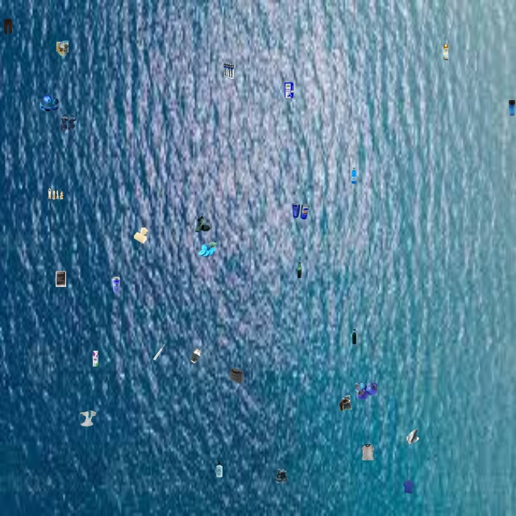

# **Sall-e – Autonomous Robot for River & Ocean Garbage Collection**


## **Background and Mission**

Plastic pollution has shifted from an open-ocean problem to a **river-borne crisis**.  
The Citarum River (West Java, Indonesia) is now cited as *“one of the most polluted rivers on Earth”*—an estimated **20 000 t of solid waste and 340 000 t of untreated wastewater** are discharged **every day** from ~2 000 industrial facilities and dense urban settlements :contentReference[oaicite:0]{index=0}. Down-river, this material becomes a primary source of marine debris.


**Sall-e** addresses this continuum—starting in rivers, ending in oceans—by combining drone imagery, AI vision models and an autonomous surface robot that can **detect, localise, and physically remove debris** with minimal ecological disturbance.


*Quick links*  
- **UI Demo (Hugging Face)** – [Access](https://binkhoale1812-sall-egarbagedetection.hf.space/ui) 
- **Inference API** – [Access](https://binkhoale1812-sall-egarbagedetection.hf.space/analyze)

---

## **Project Target: The Citarum River**

> *“Every day at least 20 000 ton of waste and 340 000 ton of sewage are dumped directly into the Citarum.” [[1]](https://indonesiaexpat.id/news/citarum-river-the-most-polluted-river-in-theworld/).

- **Scale of impact**: >25 million residents rely on the basin for drinking water, irrigation and fishing.  
- **Biodiversity loss**: Fish populations have dropped by ~60 % since 2008, which creates a very agitating barrier in the biodiversity [[2]](https://www.adb.org/results/revitalizing-citarum-river).  
- **Economic cost**: Manual clean-ups exceed several million AUD per year and expose workers to toxic sludge and drowning hazards [[3]](https://www.theguardian.com/globaldevelopment/2020/nov/02/rotten-river-life-on-one-of-the-worlds-most-polluted-waterways-photoessay).

Sall-e delivers a **continuous, autonomous** alternative capable of 24 / 7 operation and data-driven route optimisation.

---

## **Key Technologies**

| Function | Model / Algorithm | Role |
|----------|------------------|------|
| **Multi-modal Garbage Detection** | YOLOv11l (custom); YOLOv5; DETR | High-recall aerial detection |
| **Semantic Segmentation** | SegFormer-B4 | Water / garbage / obstacle masks |
| **Animal & Wildlife Safety** | YOLOv8n (on-board) + Fish/Bird classifiers | Pause collection when fauna present |
| **Navigation** | A* + greedy KNN | Shortest traversable path |
| **Pixel→GPS Localisation** | Altitude-scaled pin-hole model | Real-world coordinate conversion |
| **Post-collection Recycle** | YOLOv8s (10-class) garbage classifier | Plastic vs. metal vs. organic … |


---

## **Synthetic Testing Image Generation**  
To evaluate the model's performance in realistic scenarios, we developed a Python script `synthetic.py` to create synthetic testing images. The script performs the following tasks:

1. **Image Preparation**: Numerous ocean background image (`ocean 1-4 images`) of different sizing is resized to 640×640 pixels to match the model's input requirements.

2. **Object Extraction**: Randomly selects 10 images from the `dataset/test/images` directory and uses their corresponding YOLO-format annotation files from `dataset/test/labels` to extract labeled garbage objects.

3. **Synthetic Image Creation**: Pastes the extracted objects onto the resized ocean background at random locations, generating three synthetic testing images. These images are saved in the `testing` directory for subsequent evaluation.

<details>
  <summary><strong>List Testing Images</strong></summary>
  <details>
    <summary><strong>Testing Synthetic Environment 1</strong></summary>
    
  </details>
  <details>
    <summary><strong>Testing Synthetic Environment 2</strong></summary>
    
  </details>
  <details>
    <summary><strong>Testing Synthetic Environment 3</strong></summary>
    
  </details>
  <details>
    <summary><strong>Testing Synthetic Environment 4</strong></summary>
    
  </details>
  <details>
    <summary><strong>Testing Real Environment 1</strong></summary>
    
  </details>
  <details>
    <summary><strong>Testing Real Environment 2</strong></summary>
    
  </details>
</details>

---

## **Approach to Model Self-Training**  

To equip Sall-e with the capability to detect marine debris, we employed the YOLOv11m object detection model, leveraging the Ultralytics Hub for training and deployment. The training process involved the following steps:

1. **Dataset Selection**: We utilized the "Garbage Detection UAV" dataset from Roboflow Universe, which comprises 4,486 images annotated for various types of garbage. The dataset is partitioned into 70% training, 20% validation, and 10% testing subsets.

2. **Data Preparation**: The dataset was uploaded to the Ultralytics Hub, ensuring compatibility with the YOLOv11m model requirements.

3. **Model Configuration**:
<details>
  <summary><strong>Configuration</strong></summary>
    The <strong>YOLOv11m</strong> model was configured with the following parameters:
    <li><strong>Epochs</strong>: 200</li>
    <li><strong>Image Size</strong>: 640×640 pixels</li>
    <li><strong>Patience</strong>: 100</li>
    <li><strong>Cache Strategy</strong>: RAM</li>
    <li><strong>Device</strong>: GPU</li>
    <li><strong>Batch Size</strong>: 32</li>
</details>

4. **Training**: The model was trained using the Ultralytics Hub's infrastructure, optimizing for accuracy in detecting and localizing garbage objects in aerial imagery.

5. **Model Metrics** :
  

<details>
  <summary><strong>Model Loss Metrics</strong></summary>
      
</details>

<details>
  <summary><strong>Model Result Evaluations</strong></summary>
    
</details>

---

## **Animal Detection & Wildlife Safety**

Before each pickup, a **front-mounted HD camera** feeds frames to a lightweight animal-safety stack:

- **YOLOv8n** – detects mammals and birds in ≤ 20 ms / frame on Jetson Orin.  
- **Fish & Bird specialist models** – cloud fallback via Roboflow endpoints for finer taxa [[4]](https://universe.roboflow.com/team-hope-mmcyy/hydroquest
)[[5]](https://universe.roboflow.com/sky-sd2zq/bird_only-pt0bm/model/1).  
- **Policy** – if any detection ≥ 0.70 confidence overlaps the conveyor field-of-view, Sall-e suspends the conveyor until fauna exit the frame.  
This “stop-collect” protocol meets UNESCO AI environmental-impact guidelines.

<table>
  <tr>
    <td></td>
    <td></td>
  </tr>
  <tr>
    <td align="center"><strong>Fish Detection Output</strong></td>
    <td align="center"><strong>Bird Detection Output</strong></td>
  </tr>
</table>


## **Semantic Segmentation & Obstacle Avoidance**

The **SegFormer-B4** transformer provides pixel-wise masks:

- **Reported mIoU:** 84.4 % on ADE20K (Xie et al., 2021).  
- **Custom rule-set** re-labels ambiguous sand/garbage pixels (RGB 150-5-61) based on local density.  
- **Navigation map:** movable = water ∪ garbage. Obstacles (vegetation, banks, structures) are strictly non-traversable.


## **Garbage Classification & Recycling**

After the storage bin is full or on demand, images from an internal bin-cam are analysed by **YOLOv8s (10-class)**:

| Class | Example Output |
|-------|----------------|
| Plastic bottle | `plastic (0.91)` |
| Aluminium can  | `metal (0.88)` |
| Cardboard       | `paper (0.79)` |

These labels allow automatic **stream-separation at the deposit station**, feeding local recyclers and closing the waste loop.


---

## **Multi-Model Garbage Detection**  
The **Sall-e** project integrates multiple models to enhance garbage detection using computer vision. The implementation leverages three different object detection models:

<details>
  <summary><strong>External Model 1: YOLOv5-Based Waste Detection</strong></summary>
  <li>This model is sourced from <strong>Hugging Face</strong> and fine-tuned for waste classification.</li>
  <li>Repository: <a href="https://huggingface.co/turhancan97/yolov5-detect-trash-classification">YOLOv5 Waste Detection Model</a></li>
</details>

<details>
  <summary><strong>External Model 2: DETR-Based Waste Detection</strong></summary>
  <li>This model is built on <strong>DEtection TRansformer (DETR)</strong> architecture and fine-tuned on waste detection.</li>
  <li>Repository: <a href="https://huggingface.co/Yorai/detr-resnet-50_finetuned_detect-waste">DETR Waste Detection Model</a></li>
  <li>The model utilizes a <strong>ResNet-50</strong> backbone and processes images using PyTorch and the <italic>transformers</italic> library.</li>
</details>

<details>
  <summary><strong>List Multi-modal Detection with Annotation</strong></summary>
  <details>
    <summary><strong>Detection Synthetic Environment 1</strong></summary>
    
  </details>
  <details>
    <summary><strong>Detection Synthetic Environment 2</strong></summary>
    
  </details>
  <details>
    <summary><strong>Detection Synthetic Environment 3</strong></summary>
    
  </details>
  <details>
    <summary><strong>Detection Synthetic Environment 4</strong></summary>
    
  </details>
  <details>
    <summary><strong>Detection Real Environment 1</strong></summary>
    
  </details>
  <details>
    <summary><strong>Detection Real Environment 2</strong></summary>
    
  </details>
</details>

This multi-model approach provides better benchmarking and performance analysis for garbage detection in oceanic environments, improving robustness across different detection architectures. 

---

## **Garbage Collection Simulation Video**
The **Garbage Collection Simulation** visualizes how an autonomous floating robot, **Sall-e**, navigates an ocean environment to collect garbage using AI-based object detection.

### **Simulation Features**:
- The robot starts at the **top-left corner** of the environment.
- It detects **the nearest garbage object** and moves towards it.
- The robot can **move diagonally** and **rotates accordingly** based on its movement direction.
- The robot moves at **40 pixels per second**.
- Once the robot reaches a garbage object, the object is **flagged as collected** and removed from the scene.
- The simulation continues until all objects are collected or the user stops the program.

<a href="simulation/simulation.mp4" download>Download Simulation</a>

This simulation helps visualize the efficiency of the garbage collection system and showcases the AI-driven movement strategy of the Sall-e robot.

> *"Access real-time simulation on [FastAPI App](https://binkhoale1812-sall-egarbagedetection.hf.space/ui).

---

## **Project Setup** 

Clone this project:
```bash
  git clone https://github.com/Lelekhoa1812/Sall-e.git
```

Dependencies Installation:  
```bash
  pip install -r requirements.txt
```

Run self-trained detection:  
```bash
  python3 detect.py
```

Run multi-modal detection:  
```bash
  python3 multimodal.py
```

Run simulation - generate video:  
```bash
  python3 simulation.py
```

---

## **Project Structure**
```plaintext
/dataset/
  ├── test/
  ├── train/
  ├── valid/
  ├── data.yaml
  ├── README
/crop.py               # crop object from data sample
/synthetic.py          # generate synthetic testing img simulating ocean top-view
/detect.py             # general detection
/detect.py             # 3-model detection
/segment.py            # segment model UPerNet - river (target) avoid obstacles 
(rock, shore)
/crop/                 # cropped .png images sample from various garbage classes
  ├── plastic/
  ├── metal/
  ├── clothes/
  ├── carton/
  ├── ...
/testing/
/detect/
/detect1/
/model/
  ├── garbage_detector.pt
/src/
  ├── results.png
  ├── eval.png
  ├── loss.png 
/backend               # Demo side on Hugging Face
```

---

## **Dataset Acknowledgment**

We acknowledge the use of the **[Garbage Detection UAV](https://en.wikipedia.org/wiki/Great_Pacific_Garbage_Patch)** dataset from Roboflow Universe in our project. The dataset's key statistics are as follows:

- **Total Images**: 4,486
- **Training Set**: 70% (3,140 images)
- **Validation Set**: 20% (897 images)
- **Test Set**: 10% (449 images)

The dataset encompasses a diverse range of garbage types, providing a robust foundation for training the object detection model.

---

## **Conclusion**

The Sall-e project represents a concerted effort to harness advanced technologies in addressing the pressing issue of oceanic plastic pollution. By integrating computer vision and robotics, we aim to enhance the efficiency and effectiveness of marine debris detection and collection, contributing to the preservation of ocean health and biodiversity.

---

## **Acknowledgement of Resources**
This project is a product from unit ENG30002 - Engineering Technology Sustainability Project, Swinburne University of Technology.  
